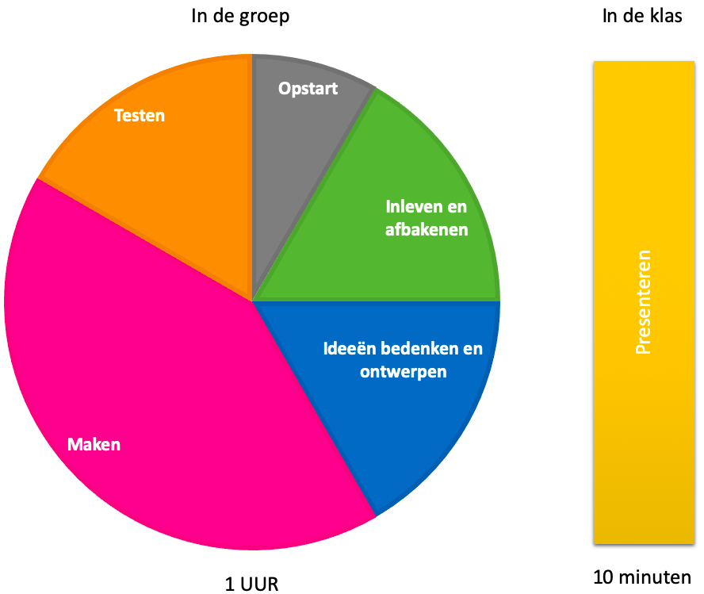

# Leren Programmeren - vaardigheden van de 21e eeuw
Cursusmateriaal voor Leren Programmeren op basis van Scratch en BeeBot. Vaardigheden van de 21e eeuw leren door te doen.

## Design thinking ("ontwerpend leren")
"Programmeren" gaat over creatie: het maken van nieuwe dingen. Creatieve mensen kunnen ontzettend goed zijn in programmeren! En er komt meer kijken bij programmeren. Je bent met programmeren bezig met het oplossen van een probleem. En niet zomaar een probleem, maar een probleem van iemand anders! Je kunt je inleven in het probleem van de ander. En je kunt plannen, je kijkt vooruit hoe je dit probleem kunt oplossen. Dit komt samen in de stappen van design thinking:

1. Inleven & afbakenen: je verzamelt informatie over het probleem dat je voor de ander wilt oplossen. Je probeert te begrijpen waar de ander mee zit. Je kiest wat je wel en niet gaat oplossen. Je kunt niet alles doen! Je bedenkt wat jij kunt oplossen van het probleem van de ander.
2. Ideeën bedenken: je gaat verzinnen hoe je het probleem kunt oplossen. Niets is hier te gek! Hoe meer ideeën hoe beter!
3. Ontwerpen: uit alle ideeën kies je wat het beste werkt. Wat het beste het probleem oplost, en door jou goed is te maken. Je beschrijft zo goed mogelijk hoe jou oplossing in elkaar zit, en denkt alvast na wat er eventueel mis kan gaan.
4. Maken: je gaat aan de slag om je ontwerp te maken!
5. Testen: nadat het maken van de oplossing, ga je het testen. Je probeert uit of jou oplossing het probleem oplost. Je laat het zien aan anderen, en aan de persoon voor wie je een oplossing hebt bedacht.
6. Presenteren: je laat je oplossing zien.

Design thinking is een herhalend proces: het kan zijn dat je oplossing bij het testen toch nog niet helemaal goed is. Geeft niet! Hoe meer je probeert, hoe beter je oplossing wordt. Je hoeft dus niet helemaal opnieuw te beginnen. Je zult zien dat je de stappen steeds sneller zult doorlopen.

Dit filmpje ([deel 1](https://youtu.be/gGuG8Bb5Fpw) en [deel 2](https://youtu.be/6bgHopWrPrg)) geeft een goed beeld van design thinking ("ontwerpend leren") in de klas.

Design thinking is een ontwerpaanpak. Iedereen kan deze aanpak gebruiken bij het maken van nieuwe dingen. Dus ook voor het ontwikkelen van lesmateriaal! Zie ook [slimmerlerenmetict](https://www.slimmerlerenmetict.nl/artikel/waar-kan-ik-design-thinking-voor-inzetten).

## Leren programmeren in de klas

Leren programmeren in de klas kan met een groepje van ongeveer zes kinderen. In een uur doorloop je bovenstaande zes stappen van design thinking. Voor grotere opdrachten is het ook mogelijk om één of een paar stappen per keer uit te voeren. Je doorloopt de volgende stappen:

#### Opstart ###

De begeleider vertelt met welk probleem je de groep aan de slag gaat. De begeider vertelt wie met het probleem zit, en waar het probleem uit bestaat.

#### Inleven, afbakenen, ideeën bedenken en ontwerpen

In een groepsgesprek laat je de groep inleven in het probleem. Als begeleider kun je vragen stellen aan de groep en laat de groep zelf tot de antwoorden komen. Bij grotere groepen kun je de 1-2-4-allemaal methode gebruiken: eerst zelf inleven, dan met z'n 2-en overleggen, vervolgens met z'n 4-en en tenslotte allemaal.

Na ongeveer 5-10 minuten kun je met de groep beginnen met het afbakenen. Dit is lastig! Een beetje hulp van de begeleider kan helpen om de groep een keuze te laten maken die zij ook kunnen maken in de tijd die je hebt.

Neem voor het bedenken van ideeën ook ongeveer 5 tot 10 minuten. Laat de groep individueel hun ideeën opschrijven of tekenen. Laat daarna iedereen individueel zijn of haar ideeën toelichten.

De ontwerpstap bestaat hier uit het kiezen welke ideeën gebruikt gaan worden. Voor grote opdrachten kun je de groep één ontwerp laten tekenen.

#### Maken

We gaan nu aan de slag! Bij de B-bot gaat het hier om het maken van het programma. Laat de groep eerst op papier of met behulp van kaartjes individueel het programma voor de B-bot maken. Bij scratch werk je direct in de programmeer-omgeving. Laat iedereen nadenken of het programma inderdaad goed gaat werken. Je kunt in groepen van twee elkaars programma bekijken en laten uitleggen waarom ze denken dat hun programma het gaat doen. Merk op dat er vaak meerdere oplossingen zijn! Een verschillend programma hoeft niet te betekenen dat er eentje fout is! Het gaat hier vooral om dat de leerling begrijpt hoe zijn of haar programma werkt, en dat hij of zij dit kan uitleggen aan een ander. Neem voor het maken ongeveer 25-30 minuten.

#### Testen

We beginnen het testen in de groep. Voor de B-bot betekent dit het invoeren van het programma op de B-bot en vervolgens kijken of de B-bot het programma volgens verwachting uitvoert. Bij scratch betekent dit het drukken op het vlaggetje en vervolgens kijken of het programma goed werkt.

In beide gevallen kan het goed zijn dat jou programma niet goed werkt. Je kijkt waardoor dit komt, eventueel in overleg met iemand anders en past je programma aan.

#### Laten zien in de klas

Het het super leuk om het eindresultaat in de klas te laten zien! Laat de groep vertellen wat ze hebben gedaan, en probeer daarbij de stappen van design thinking aan te houden. Tenslotte kun je het eindresultaat laten zien. Met de B-bot kun je dit op de grond van het klaslokaal doen, met scratch kan dit eventueel op het smartbord, of direct achter de chromebooks.

## Vaardigheden van de 21e eeuw
Met leren programmeren werken we aan de vaardigheden van de 21e eeuw. Op een manier die voor kinderen niet direct wordt ervaren als "in de klas zitten". Mogelijk komt dit doordat de nadruk niet ligt op het het opdoen van kennis, maar op het creatieve proces: leren door te doen. En je zit natuurlijk ook niet letterlijk meer "in de klas"! Onderstaand figuur, [ontwikkeld door SLO en Kennisnet](https://www.kennisnet.nl/artikel/alles-wat-je-moet-weten-over-21e-eeuwse-vaardigheden/), geeft een overzicht van deze vaardigheden. Goed zichtbaar is de samenhang tussen deze vaardigheden en design thinking!

## B-Bot

De B-bot is een makkelijke manier om te beginnen met programmeren. Het is al geschikt voor kinderen vanaf groep 1! Naast programmeren leren kinderen ook richting, zoals links en rechts. Maar ook je inbeelden in de ander. Want als de B-bot op je af komt, dan is links en rechts voor de B-bot iets anders dan voor jou!

Het is goed te doen om zelf opdrachten te bedenken voor de B-bot. Zie ook op deze site. Meer informatie en opdrachten zijn bijvoorbeeld hier te vinden: [www.edubot.nl](http://www.edubot.nl/projecten/bee-en-bluebot)

## Scratch

Scratch is een programmeertaal speciaal ontwikkeld voor kinderen, door het M.I.T. Je kunt er spelletjes mee maken, tekenfilmpjes en nog veel meer! En je leert programmeren op een manier die lijkt op het bouwen met lego.

Scratch werkt direct vanaf het internet, via de website [scratch.mit.edu](https://scratch.mit.edu). Klik op "Aan de slag" en probeer het uit! Via het wereldbolletje linksboven kun je kiezen voor "Nederlands", zodat je gewoon met Nederlandse woorden kunt programmeren.
